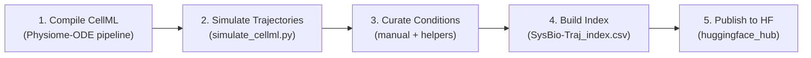

# CellML-to-SysBio-Traj: Integration & Publishing Roadmap

This document is a step-by-step guide for taking compiled Physiome-ODE (CellML) models through the full pipeline — from raw wrapped Python modules to a published Hugging Face dataset in the **SysBio-Traj** format used by **RegimeFlow** (ICML 2026).

It builds directly on the [RegimeFlow Physiome Formatting Guide](./RegimeFlow_Physiome_Formatting_Guide.md), which defines the file schemas and directory layout. This document adds the **how**: the exact commands, decisions, and verification steps needed to execute.

---

## Pipeline Overview



---

## Phase 1 — Compile CellML Models

### What This Phase Does
Converts raw CellML/XML models from the [Physiome Model Repository](https://models.physiomeproject.org/) into standalone Python wrappers that expose an ODE system via `scipy.integrate.odeint`.

### Prerequisites
- Python 3.8+
- OpenCOR installed and on PATH
- The `Physiome-ODE` pipeline scripts (`get_python_files.py`, `process_cellml.py`, `append_all_wrappers.py`)

### Steps

**1a.** Export Python from CellML using OpenCOR's command-line interface:
```bash
python Physiome-ODE/get_python_files.py
```
This produces raw `*_python.py` files from each `.cellml` model.

**1b.** Process and fix the raw exports:
```bash
python Physiome-ODE/process_cellml.py
```
Cleans up import issues, function names, and formatting.

**1c.** Generate the wrapped ODE modules:
```bash
python Physiome-ODE/append_all_wrappers.py
```
Each model directory now contains a `<model_name>_wrapped.py` file that exposes:
- `Parameters()` — a class holding all model constants
- `Config(param, calculate, y0)` — initializes the ODE system; provides:
  - `config.y0` — default initial state values
  - `config.state_names` — list of state variable names
  - `config.pend(y, t)` — the right-hand-side function for `odeint`

### Output
```
Physiome-ODE/wrapped_models/<domain>/<model_name>/<model_name>_wrapped.py
```

> [!TIP]
> You only need to run this phase once per model. The wrapped modules are self-contained Python files with no dependency on OpenCOR at runtime.

---

## Phase 2 — Simulate Trajectories

### What This Phase Does
Runs each wrapped model through `scipy.integrate.odeint` on a uniform 512-point time grid and saves the resulting multivariate trajectory as a CSV.

### The Script
Use [`simulate_cellml.py`](./simulate_cellml.py), which is modeled after the original `simulate_sbml.py` from the SysBio-Traj dataset.

### Usage Examples

**Basic simulation** (uses model defaults):
```bash
python simulate_cellml.py \
  --model-dir Physiome-ODE/wrapped_models/calcium_dynamics/dupont_1991a \
  --model-name dupont_1991a \
  --start-time 0 \
  --end-time 30 \
  --num-timepoints 512
```

**With initial-condition overrides**:
```bash
python simulate_cellml.py \
  --model-dir Physiome-ODE/wrapped_models/calcium_dynamics/dupont_1991a \
  --model-name dupont_1991a \
  --start-time 0 \
  --end-time 30 \
  --num-timepoints 512 \
  --use-ic-json \
  --output Data/dupont_1991a/dupont_1991a.csv
```

**Direct path to a wrapped file**:
```bash
python simulate_cellml.py \
  --wrapped-file /path/to/model_wrapped.py \
  --start-time 0 \
  --end-time 100 \
  --num-timepoints 512 \
  --output /path/to/output.csv
```

### How to Pick Time Ranges

The `time_start` and `time_end` values are **not arbitrary**. They must be chosen so that the simulated trajectory captures the model's characteristic dynamics (e.g., full oscillation periods, or convergence to equilibrium).

| Strategy | When to use |
|---|---|
| Use the publication's figure axes | Best default — matches the author's intended regime |
| Run a long exploratory sim first | When no publication figure is available — run 10x the expected time, then trim |
| Match an existing SysBio-Traj entry | If a BioModels version of the same system exists, use its `time_span` |

### Output
For each model, you should have:
```
Data/<model_id>/<model_name>.csv    # 512-row CSV, columns: time, state1, state2, ...
```

> [!IMPORTANT]
> The CSV **must** have exactly 512 rows. RegimeFlow's neural architecture expects this fixed sequence length. The `simulate_cellml.py` script enforces this via `np.linspace(start, end, 512)`.

---

## Phase 3 — Curate Regime Annotations

### What This Phase Does
Creates two JSON files per model:
1. `initial_conditions.json` — records the exact state/parameter values used to produce the CSV
2. `<model_name>_conditions.json` — regime classification for each state variable

### 3a. Create `initial_conditions.json`

This file records the exact parameterization that produced the simulated CSV, enabling anyone to reproduce the trajectory.

**SysBio-Traj format** (use this for the final dataset):
```json
{
  "initial_time": 0.0,
  "initial_conditions": {
    "Z": 0.52,
    "Y": 0.93
  }
}
```

**How to extract the defaults programmatically**:
```python
import importlib.util, sys, json
from pathlib import Path

# Load the wrapped model
spec = importlib.util.spec_from_file_location("m", "dupont_1991a_wrapped.py")
mod = importlib.util.module_from_spec(spec)
spec.loader.exec_module(mod)

params = mod.Parameters()
config = mod.Config(param=params, calculate=False)

ic = {
    "initial_time": 0.0,
    "initial_conditions": dict(zip(config.state_names, config.y0))
}
print(json.dumps(ic, indent=2))
```

If you want to override any values (e.g., matching a specific figure from a publication), edit the JSON manually before simulating.

### 3b. Create `<model_name>_conditions.json`

This is the **most labour-intensive step** and the one where accuracy matters most.

**Target format** (per state variable):
```json
{
  "Z": {
    "trajectory_type": 3,
    "trajectory_type_name": "oscillation",
    "bounds": [0.05, 1.25],
    "period": 42.0
  },
  "Y": {
    "trajectory_type": 0,
    "trajectory_type_name": "directly_stable",
    "bounds": [0.1, 0.95],
    "period": 0.0
  }
}
```

**The six regime classes** (from the RegimeFlow taxonomy):

| Code | Name | Description |
|------|------|-------------|
| 0 | `directly_stable` | Settles to equilibrium without monotonic approach (complex transient) |
| 1 | `inc_stable` | Increases then stabilizes |
| 2 | `dec_stable` | Decreases then stabilizes |
| 3 | `oscillation` | Sustained periodic oscillations |
| 4 | `increasing` | Monotonically increasing (never stabilizes in the window) |
| 5 | `decreasing` | Monotonically decreasing (never stabilizes in the window) |

**What can be automated vs. what must be manual**:

| Field | Method |
|---|---|
| `bounds` | ✅ Automated — `[min(column), max(column)]` from the CSV |
| `period` | ⚠️ Semi-automated — use peak detection (`scipy.signal.find_peaks`) or FFT, then verify visually |
| `trajectory_type` | ❌ **Manual** — plot each variable and classify by eye |
| `trajectory_type_name` | ❌ **Manual** — string name matching the `trajectory_type` code |

> [!WARNING]
> **Why manual classification is essential:**
> Automated heuristics frequently misclassify biological trajectories:
> - Damped oscillations → wrongly labelled `oscillation` instead of `directly_stable`
> - Slow sigmoid rise → wrongly labelled `increasing` instead of `inc_stable`
> - Noisy plateaus → wrongly labelled `oscillation`
>
> The SysBio-Traj authors curated their labels manually for this reason.

**Helper snippet for `bounds` and `period` estimation**:
```python
import pandas as pd
import numpy as np
from scipy.signal import find_peaks

df = pd.read_csv("Data/dupont_1991a/dupont_1991a.csv")

conditions = {}
for col in df.columns:
    if col == "time":
        continue
    vals = df[col].values
    bounds = [float(np.min(vals)), float(np.max(vals))]

    # Estimate period from peak-to-peak spacing (if oscillatory)
    peaks, _ = find_peaks(vals, distance=20)
    if len(peaks) >= 2:
        dt = np.diff(df["time"].values[peaks])
        period = float(np.mean(dt))
    else:
        period = 0.0

    conditions[col] = {
        "trajectory_type": -1,         # <-- FILL IN MANUALLY
        "trajectory_type_name": "TODO", # <-- FILL IN MANUALLY
        "bounds": bounds,
        "period": period
    }

import json
print(json.dumps(conditions, indent=2))
```

---

## Phase 4 — Assemble the Dataset Directory

### What This Phase Does
Arranges all generated files into the canonical SysBio-Traj directory layout and creates the global index CSV.

### Target Layout
```
SysBio-Traj-CellML/
├── README.md
├── SysBio-Traj_index.csv
├── scripts/
│   └── simulate_cellml.py
└── Data/
    ├── dupont_1991a/
    │   ├── dupont_1991a.csv
    │   ├── dupont_1991a.cellml              # (optional) original CellML source
    │   ├── initial_conditions.json
    │   └── dupont_1991a_conditions.json
    ├── hodgkin_huxley_1952/
    │   ├── hodgkin_huxley_1952.csv
    │   ├── initial_conditions.json
    │   └── hodgkin_huxley_1952_conditions.json
    └── ...
```

### Build the Index CSV

The index CSV is a flat table with one row per model. Create it programmatically:

```python
import csv
from pathlib import Path

data_dir = Path("SysBio-Traj-CellML/Data")
rows = []

for model_dir in sorted(data_dir.iterdir()):
    if not model_dir.is_dir():
        continue
    csv_files = list(model_dir.glob("*.csv"))
    if not csv_files:
        continue

    model_id = model_dir.name
    model_name = csv_files[0].stem  # e.g., dupont_1991a

    # Read time range from the CSV
    import pandas as pd
    df = pd.read_csv(csv_files[0])
    t_start = float(df["time"].iloc[0])
    t_end = float(df["time"].iloc[-1])

    rows.append({
        "model_id": model_id,
        "model_name": model_name,
        "time_start": t_start,
        "time_end": t_end,
        "time_span": round(t_end - t_start, 1),
    })

with open("SysBio-Traj-CellML/SysBio-Traj_index.csv", "w", newline="") as f:
    writer = csv.DictWriter(f, fieldnames=["model_id", "model_name", "time_start", "time_end", "time_span"])
    writer.writeheader()
    writer.writerows(rows)
```

### Checklist Before Publishing

For each model in `Data/`, verify:

- [ ] `<model_name>.csv` exists and has exactly 512 rows (+ header)
- [ ] `initial_conditions.json` exists and matches what was used to generate the CSV
- [ ] `<model_name>_conditions.json` exists with no `"TODO"` or `-1` values remaining
- [ ] All `trajectory_type` values are in `{0, 1, 2, 3, 4, 5}`
- [ ] `bounds` values are reasonable (no NaN, no Inf)
- [ ] `SysBio-Traj_index.csv` has a row for this model
- [ ] Column names in the CSV match the keys in the conditions JSON

---

## Phase 5 — Publish to Hugging Face

### What This Phase Does
Pushes the assembled dataset to a Hugging Face Hub repository so it can be loaded by the RegimeFlow training pipeline.

### Prerequisites
```bash
pip install huggingface_hub
huggingface-cli login
```

### Option A — Upload via CLI (simplest)

```bash
huggingface-cli upload <your-username>/SysBio-Traj-CellML \
  ./SysBio-Traj-CellML \
  --repo-type dataset
```

### Option B — Upload via Python API (more control)

```python
from huggingface_hub import HfApi

api = HfApi()

# Create the dataset repo (once)
api.create_repo(
    repo_id="<your-username>/SysBio-Traj-CellML",
    repo_type="dataset",
    private=False,  # set True for private
)

# Upload the entire directory
api.upload_folder(
    folder_path="./SysBio-Traj-CellML",
    repo_id="<your-username>/SysBio-Traj-CellML",
    repo_type="dataset",
    commit_message="Initial upload of CellML-derived SysBio-Traj dataset",
)
```

### Write the README.md (Dataset Card)

Hugging Face datasets require a `README.md` with YAML front-matter. Model yours after the original:

```markdown
---
pretty_name: SysBio-Traj-CellML
license: cc-by-4.0
size_categories:
- n<1K
---

# SysBio-Traj-CellML

CellML-derived extension of the SysBio-Traj dataset for the
[RegimeFlow](https://github.com/zhaoxixixi/RegimeFlow) trajectory prediction framework.

## Source
Models compiled from the [Physiome Model Repository](https://models.physiomeproject.org/)
using the Physiome-ODE pipeline (OpenCOR + scipy).

## Format
Identical to [HengRao/SysBio-Traj](https://huggingface.co/datasets/HengRao/SysBio-Traj).
Each model directory contains:
- `<name>.csv` — 512-point trajectory
- `initial_conditions.json` — state/parameter values
- `<name>_conditions.json` — regime annotations

## Index
See `SysBio-Traj_index.csv` for the full model catalog.
```

---

## Quick Reference: Side-by-Side Comparison

| Aspect | SysBio-Traj (SBML) | SysBio-Traj-CellML (this project) |
|---|---|---|
| **Source format** | SBML XML (BioModels) | CellML XML (Physiome) |
| **Simulator** | Tellurium (`te.loadSBMLModel`) | scipy (`odeint` via `*_wrapped.py`) |
| **Script** | `simulate_sbml.py` | `simulate_cellml.py` |
| **IC JSON keys** | `initial_time`, `initial_conditions` | Same (converted from `states`/`parameters`) |
| **Conditions JSON** | per-variable `trajectory_type`, `bounds`, `period` | Identical schema |
| **Time points** | 512 | 512 |
| **Index CSV** | `model_id`, `model_name`, `time_start`, `time_end`, `time_span` | Identical schema |

---

## Troubleshooting

### `odeint` returns NaN or blows up
- **Cause**: Time span too long, stiff system, or bad initial conditions
- **Fix**: Shorten `time_end`, try different initial conditions, or add `mxstep=5000` to the `odeint` call in `simulate_cellml.py`

### Wrapped module fails to import
- **Cause**: The OpenCOR Python export uses features not compatible with your Python version
- **Fix**: Ensure you ran `process_cellml.py` and `append_all_wrappers.py` successfully; check for syntax errors in the wrapped file

### Peak detection returns wrong period
- **Cause**: Signal is noisy or oscillation is damped
- **Fix**: Increase the `distance` parameter in `find_peaks`, or use FFT instead. Always verify visually.

### Trajectory looks flat even though model should oscillate
- **Cause**: Wrong parameter values or insufficient simulation time
- **Fix**: Check the publication for the expected time range; ensure `initial_conditions.json` values match the paper's figures
