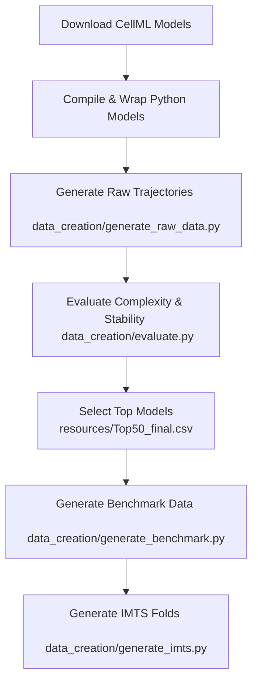

# Physiome-ODE: Architecture, Purpose, and Compilation Pipeline

This document provides a detailed explanation of the **Physiome-ODE** benchmark and its components. It highlights the original ICLR 2025 benchmark functionality alongside the local code compilation, model validation, and simulation-wrapping pipeline that has been added to it.

---

## 1. What is Physiome-ODE?

**Physiome-ODE** is a benchmark for **Irregularly Sampled Multivariate Time-Series (IMTS) Forecasting** based on ordinary differential equations (ODEs). Submitted to the *Thirteenth International Conference on Learning Representations (ICLR 2025)*, it leverages biological and physiological dynamical models sourced from the [Physiome Model Repository](https://models.physiomeproject.org/) (which hosts models defined in the XML-based **CellML** format).

### Core Objectives
1. **Irregularly Sampled Benchmarking**: To evaluate deep learning models designed for irregularly sampled, sparse multivariate time-series (such as *GRU-ODE-Bayes*, *LinODENet*, *CRU*, *Neural Flows*, and *GraFITi*).
2. **Physical/Biological Realism**: Instead of synthetic toy datasets, it simulates real-world biochemical, cardiovascular, electrophysiological, and immunological systems.
3. **Regular TSF Assessment**: In addition to irregularly sampled forecasting (IMTS), the project includes a sub-study (`ODE-Datasets-for-Regular-TSF/`) focusing on channel interactions (Channel Independence vs. Channel Dependence) in regular long-term time-series forecasting (using models like *DLinear*, *PatchTST*, and *TSMixer*).

---

## 2. Original vs. Added Infrastructure

By comparing `Physiome-ODE` to the original repository `Physiome-ODE-github`, we can see that a **complete local compilation, wrapping, and simulation pipeline** has been introduced. 

The original codebase crawled pre-compiled Python files from the Physiome website. The added pipeline (found inside `Physiome-ODE-extra-files`) introduces the ability to **locally download, validate, compile (using OpenCOR), wrap (using standard SciPy solvers), and simulate** models from raw `.cellml` files.

### Added Directories
- [cellml_files/](file:///c:/Users/Benem/Downloads/Regime-Flow-AI/fixing-regimeflow/Physiome-ODE/cellml_files): Stores raw `.cellml` XML model files downloaded from the repository.
- [models_cellml2/](file:///c:/Users/Benem/Downloads/Regime-Flow-AI/fixing-regimeflow/Physiome-ODE/models_cellml2): Categorizes downloaded `.cellml` files into biological domains (e.g., `calcium_dynamics`, `endocrine`, `cardiovascular_circulation`).
- [exported_cellml_models/](file:///c:/Users/Benem/Downloads/Regime-Flow-AI/fixing-regimeflow/Physiome-ODE/exported_cellml_models): Stores raw Python scripts generated by OpenCOR's command-line interface.
- [wrapped_models/](file:///c:/Users/Benem/Downloads/Regime-Flow-AI/fixing-regimeflow/Physiome-ODE/wrapped_models): Holds final wrapped packages for each model containing:
  - `model.cellml`: Source definition.
  - `model_wrapped.py`: Clean executable model compiled with a SciPy integration interface.
  - `model_conditions.json`: Default parameters and initial values.
  - `model.csv`: The generated trajectory output.
- [Physiome-PDE/](file:///c:/Users/Benem/Downloads/Regime-Flow-AI/fixing-regimeflow/Physiome-ODE/Physiome-PDE): A directory containing models containing partial differential equations (PDEs) which were separated because they cannot be resolved via ODE solvers.
- [wrapper testing/](file:///c:/Users/Benem/Downloads/Regime-Flow-AI/fixing-regimeflow/Physiome-ODE/wrapper%20testing): A testing sandbox for verifying wrapping scripts.

---

## 3. Added Pipeline Components & File Roles

The following table documents the purpose of the scripts and notebooks added to the repository:

| File Name | Role & Functionality |
| :--- | :--- |
| **`download_all_cellml.ipynb`** `download_failed.ipynb` | **Scraper/Downloader**: Crawls the web pages of the Physiome Model Repository to download raw `.cellml` XML files and groups them into domain folders under `models_cellml2/`. |
| **`get_python_files.py`** `get_python_files_2.py` `get_python_files_parallel.py` | **OpenCOR Compiler**: Orchestrates the OpenCOR executable command-line interface (`CellMLTools::validate` and `CellMLTools::export <model> python`) to validate models and compile XML-based CellML into executable Python scripts. It also flags underconstrained models. |
| **`process_cellml.py`** | **Equation & Variable Parser**: Uses `libcellml` and `lxml` to parse the equations within the XML, count differential vs. algebraic expressions, and compute variable equivalence classes to resolve name mappings. |
| **`append_all_wrappers.py`** | **Scipy Wrapper Generator**: Parses the raw Python scripts output by OpenCOR and appends a standardized wrapper class (`Config` and `Parameters`), exposing initial states, parameter dictionaries, and rates. This makes them immediately runnable via standard solvers. |
| **`run_all_wrapped_models.py`** | **Batch Simulator**: Discovers all files matching `*_wrapped.py` under `wrapped_models/`, loads initial states, runs numerical integration via `scipy.integrate.odeint`, and saves output trajectories to `model.csv`. |
| **`copy_PDEs.py`** | **PDE filter**: Reads the CellML model list and copies models with `PDE count > 0` into the `Physiome-PDE` folder to filter them out of the ODE pipeline. |
| **`filter_Cellml_model_list_based_on_batch.py`** | **Utility**: Filters csv model lists based on active batch runs. |
| **`make_the_table.ipynb`** `table_view.ipynb` `read_cellml.ipynb` | **Analysis**: Notebooks used to load metadata lists, analyze variable mappings, and view the statuses of the generated datasets. |

---

## 4. The Data Creation & Evaluation Workflow

To build or modify the datasets used by the forecasting benchmark, the project uses the tools inside [data_creation/](file:///c:/Users/Benem/Downloads/Regime-Flow-AI/fixing-regimeflow/Physiome-ODE/data_creation):

1. **Simulate Variations**: `generate_raw_data.py` runs 100 simulations for each combination of duration scale ($\sigma_{dur}$), initial state scale ($\sigma_{states}$), and constants scale ($\sigma_{const}$) to capture variability.
2. **Evaluate Complexity**: `evaluate.py` evaluates these trajectories, computing the *Junction Generalization Distance (JGD)* metric across the top channels to measure the dynamical complexity.
3. **Select and Export**: Based on the results, the most stable and complex models (typically the Top 50, tracked in `Top50_final.csv`) are selected.
4. **Irregularize**: `generate_imts.py` samples the simulated data irregularly (introducing missing values and random intervals) and splits them into 5 folds of train, validation, and test sets.

---

## 5. Important Outputs and Their Use Cases

When running the pipeline scripts, several key output files are generated. These files form the dataset that evaluates the machine learning models.

### A. Raw Simulation Trajectories (`.parquet` files)
- **Generated by**: `generate_raw_data.py` (during hyperparameter sweep) and `generate_benchmark.py` (for the final selected models).
- **Contents**: A multi-dimensional time-series representing the state variables of the physical/biological system (e.g., voltages, concentrations, flow rates) sampled over time.
- **Why they are created**: They provide fully observed, clean, deterministic trajectories. They represent the "ground truth" dynamics of the biological systems under parameter perturbations before noise and sparsity are introduced.

### B. Configuration Sweeps (`best_config.json` & `best_config_top10.json`)
- **Generated by**: `evaluate.py`.
- **Contents**: The specific hyperparameter settings (duration scale $T$, initial condition noise $\sigma_{states}$, and constant parameter noise $\sigma_{const}$) that yield the most complex dynamics for a model, along with their scores.
- **Why they are created**: To prevent selecting flat-lines or quick steady-states. These files record the parameters that maximize dynamic behavior.

### C. Final IMTS Folds (`train.pt`, `valid.pt`, `test.pt` under `data/final/`)
- **Generated by**: `generate_imts.py`.
- **Contents**: Serialized PyTorch datasets containing five cross-validation folds. The trajectories are normalized, added with measurement noise ($\sigma_{noise} = 0.05$), and have channels/timestamps heavily masked out (dropping ~80% of observations) to simulate real-world, sparse, and irregularly sampled observations.
- **Why they are created**: These are the actual datasets loaded during training (e.g., by `train_gruodebayes.py`). Models are trained to reconstruct/forecast target channels from these highly sparse inputs.

---

## 6. The `Top50_final.csv` Registry

The file `resources/Top50_final.csv` serves as the **master registry** for the Physiome-ODE benchmark. 

### Why Select the "Top 50"?
The raw Physiome Model Repository contains hundreds of CellML models, but many are:
1. **Redundant or too simple**: Resulting in trivial flat lines or basic linear decay.
2. **Numerically unstable**: Triggering errors or floating-point overflows in numerical ODE solvers (like SciPy's `odeint`).
3. **Non-ODEs**: Representing partial differential equations (PDEs) or underconstrained systems that cannot be simulated as standard initial value problems.

By validating, performing parameter sweeps, and scoring trajectories, the benchmark developers filtered these down to the **top 50 models** that are stable, purely ODE-based, and mathematically complex.

### What Data is Stored in `Top50_final.csv`?
For each selected system, the CSV records the following configuration columns:

| Column Name | Description | Example |
| :--- | :--- | :--- |
| `domain` | The biological or physiological domain of the model. | `calcium_dynamics` |
| `model` | The unique name of the model in the Physiome exposure list. | `dupont_1991a` |
| `total_samples` | Number of trajectories simulated per system. | `100` |
| `T` | The optimized time duration of the simulation. | `30.0` |
| `N_t` | Number of time steps evaluated. | `100` |
| `d_constants` | The noise scale ($\sigma_{const}$) applied to constant parameters. | `0.05` |
| `d_states` | The noise scale ($\sigma_{states}$) applied to initial states. | `0.3` |
| `rand_start` | Whether the starting time of observations is randomized. | `False` |
| `high_score` | The Junction Generalization Distance (JGD) complexity score. | `2.69704` |
| `channel_scores` | List of complexity scores calculated for each individual state variable. | `[2.876, 2.517]` |
| `constants` | Total number of constant parameters in the model. | `13` |
| `channel` | Total number of state variables (channels) in the model. | `2` |
| `Time Unit` | The biological unit of time. | `second` |

### How the Registry is Used in the Pipeline
- **Forecasting Targets**: `generate_imts.py` reads `channel_scores` from the registry and extracts the indices of the **top 10 most dynamic channels** to designate them as the forecasting targets.
- **Simulation Parameters**: `generate_benchmark.py` queries the CSV to retrieve the custom $T$, $\sigma_{const}$, and $\sigma_{states}$ configuration for each system to ensure simulations generate realistic complexity.
